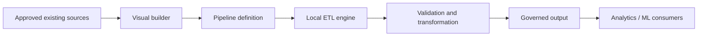

# Local Pipeline Studio

## Project Summary

Local Pipeline Studio is a proposed local-first visual ETL platform for Concordia University’s SOEN 490 capstone. It aims to help process specialists build, validate, execute, inspect, version and reuse manufacturing data pipelines that integrate approved existing sources and models with analytics and machine-learning workflows.

## Release 1 Plan

The team has supplied the **Industrial Data Pipeline Engineering Platform** Release 1 target for industry partner **Pratt & Whitney Canada**. Local Pipeline Studio remains the existing product alias. See the [Release 1 setup report](docs/release-1-setup-report.md) for assigned issues, estimates, dependencies and review rotation, and the [target architecture](docs/architecture/release-1-target.md) for the specified stack. These are future engineering commitments, not completed product features or stakeholder approvals.

## Project Status

**Planning and repository foundation. No application is implemented yet.** This repository provides engineering workflows, documentation templates and repository CI. The Release 1 target architecture and backlog are now specified; compatible dependency versions, implementation decisions and team capacity still require refinement. No releases or stakeholder approvals are claimed. See the [baseline audit](SOEN490_REPO_AUDIT.md).

## Problem

Preparing manufacturing data can involve repeated manual integration and inconsistent validation. The team must validate this problem, representative workflows and access to approved data with the stakeholder.

## Proposed Solution

A visual builder that produces reproducible pipeline definitions, executes locally, exposes intermediate previews and publishes governed outputs. Existing sources and data models remain authoritative.

## Key Features

All product capabilities are **planned**: visual construction; reusable ETL blocks; file, SQL and REST ingestion; transformations; schema and quality validation; previews; local execution; logs and run history; pipeline versioning and reuse; governed Parquet/dataset outputs; potential local API; analytics and ML preparation; secure configuration. Scope and sequencing await stakeholder validation.

## Architecture Overview



This is a proposed logical architecture. See [component status and boundaries](docs/architecture/system-architecture.md).

## Technology Stack

| Area | Current state |
|---|---|
| Target product stack (not installed) | React 19/TypeScript/Vite, FastAPI/Python 3.12, Polars/PyArrow, Parquet/DuckDB, SQLite/SQLAlchemy/Alembic |
| Target product tests/quality (not installed) | pytest, Vitest/React Testing Library, Playwright, Ruff/mypy, ESLint/Prettier; package manager/lock details require foundation work |
| Repository tooling | Python 3.11+ standard library; Bash; Git |
| CI | GitHub Actions for repository checks; application CI pending |

## Getting Started

Follow the [detailed developer guide](docs/getting-started.md), including troubleshooting and unavailable application commands. A new developer can clone and validate the repository today. Running the product will become possible after the first application implementation; no application install/start/build commands currently exist.

## Prerequisites

Git and Python 3.11+; Bash for GitHub setup scripts. GitHub CLI is optional for remote administration. No database, Node.js runtime, Python packages or credentials are required for repository checks.

## Installation

```sh
git clone https://github.com/ham340i/Industrial-Data-Pipelinen-Platform.git
cd Industrial-Data-Pipelinen-Platform
python3 --version
```

There are no application dependencies to install. Repository tooling uses only the standard library.

## Configuration

Repository checks require no configuration. No application environment variables exist yet, so no `.env.example` is supplied. Future configuration must document non-secret defaults and use local secret storage; see the [security plan](docs/security/security-plan.md).

## API Development

The API uses Python 3.12, FastAPI and Pydantic v2.

Create and activate the virtual environment:

```bash
python3.12 -m venv .venv
source .venv/bin/activate
```

Install the application dependencies:

```bash
python -m pip install --upgrade pip
python -m pip install -r requirements.txt
```

Start the local API:

```bash
python -m uvicorn app.main:app --host 127.0.0.1 --port 8000 --reload
```

The API is available at:

- Health endpoint: `http://127.0.0.1:8000/api/v1/health`
- OpenAPI documentation: `http://127.0.0.1:8000/docs`
- OpenAPI schema: `http://127.0.0.1:8000/openapi.json`

Run the API tests:

```bash
python -m pytest -q
```

The API shell currently provides versioned contracts, request validation, structured error responses and correlation IDs. Pipeline-engine execution logic is outside the scope of this initial API implementation.

To stop the local server, press `Ctrl+C` in the terminal running Uvicorn.

## Running Locally

```sh
python3 scripts/check_repository.py
python3 scripts/check_docs.py
```

These validate the repository; they do not start an ETL application. The first implementation PR must add verified install, configuration, start, test and build commands here.

## Testing

### Running Tests

```sh
python3 -m unittest discover -s scripts/tests -v
```

These exercise repository-checking tools. Product unit, integration and end-to-end tests do not exist yet. See the [testing plan](docs/testing/testing-plan.md) and [observed validation](docs/testing/repository-validation.md).

## Continuous Integration

[GitHub Actions](https://github.com/ham340i/Industrial-Data-Pipelinen-Platform/actions) runs `Repository checks` and `Documentation checks` on PRs and pushes to main. Both passed on the audited baseline. Main requires these checks, an up-to-date branch, one teammate approval and resolved conversations. See [compliance evidence](docs/SOEN490_COMPLIANCE_AUDIT.md).

## Deployment

There is no product deployment artifact yet. See the [environment, rollout and rollback plan](docs/deployment/deployment-plan.md); no stakeholder or production release is claimed.

## Repository Structure

```text
.github/                Issue/PR forms, contribution policy and Actions
scripts/                Repository checks and GitHub administration helpers
docs/architecture/      Proposed boundaries and ADR template
docs/planning/          Schedule, Project setup, risks, scope and learning
docs/iterations/        Iteration evidence template
docs/releases/          Release evidence template
docs/meetings/           Minutes template
docs/stakeholder/        Review and signoff template
docs/testing/           Test strategy and repository validation
docs/security/          Credential and data handling
docs/performance/       Measurement plan
docs/deployment/        Environment and rollout plan
docs/legal/             Decisions requiring authorized approval
docs/demos/             Future video links
```

## Development

Use an issue-linked branch and the [contribution guide](CONTRIBUTING.md). Current development concerns Python/Bash repository utilities and documentation; the target product stack is documented but not implemented.

## Team Workflow

Requirement → feature label → issue → design → branch → commits → PR → tests → iteration → release → stakeholder feedback. Use [Contributing](.github/CONTRIBUTING.md) and the [Definition of Done](docs/planning/definition-of-done.md). Plan approximately two iterations ahead; each student needs visible engineering contributions every iteration.

## GitHub Project Board

Project: **SOEN 490 - Industrial Data Pipeline Platform**. URL: **TODO — create/link the actual board**. The authenticated API cannot access Projects with the current token scope. Follow [Project setup](docs/GITHUB_PROJECT_SETUP.md), including sharing with **moar82**. [Milestones](docs/milestones.md) and [active labels](docs/github-labels.md) are now configured.

## Iterations & Releases

See the [live milestone schedule](docs/milestones.md) and [iteration process](docs/iterations/README.md). Completion tags are `Iteration1` … `Iteration13`; release tags are `Release1`, `Release2`, `Release3`. Create them only after real completion. [Release process](docs/releases/README.md).

## Documentation / Wiki

The [documentation index](docs/README.md) links all engineering and course evidence. [Compliance audit](docs/SOEN490_COMPLIANCE_AUDIT.md) records current findings, actions and remaining evidence. [Requirements matrix](docs/SOEN490_REQUIREMENTS_MATRIX.md) provides the original brief coverage.

| Topic | Documentation |
|---|---|
| Onboarding / project | [Developer guide](docs/getting-started.md), [audit](docs/SOEN490_COMPLIANCE_AUDIT.md) |
| Design / tools | [Architecture](docs/architecture/README.md), [infrastructure](docs/planning/infrastructure-and-tools.md), [naming](docs/planning/naming-conventions.md) |
| Planning | [Milestones](docs/milestones.md), [labels](docs/github-labels.md), [Project](docs/GITHUB_PROJECT_SETUP.md), [risks](docs/planning/risks.md) |
| Quality | [Testing](docs/testing/testing-plan.md), [security](docs/security/security-plan.md), [performance](docs/performance/performance-plan.md), [deployment](docs/deployment/deployment-plan.md) |
| Governance | [Legal/IP](docs/legal/README.md), [ethics](docs/legal/legal-and-ethical-issues.md), [consent draft](docs/user-consent-eula.md), [AI](docs/ai-usage.md) |
| Stakeholder / users | [Signoff](docs/stakeholder/README.md), [personas](docs/planning/personas.md), [diversity](docs/planning/diversity.md) |
| Cost / value | [Budget](docs/planning/budget.md), [economic impact](docs/planning/economic-impact.md) |
| Engineering evidence | [Traceability](docs/traceability.md), [personal contributions](docs/individual-contributions/README.md), [learning](docs/planning/independent-learning.md), [meetings](docs/meetings/README.md) |
| Delivery | [Iterations](docs/iterations/README.md), [releases](docs/releases/README.md), [demos](docs/demos/README.md) |

The [GitHub Wiki](https://github.com/ham340i/Industrial-Data-Pipelinen-Platform/wiki) provides a documentation entry point. Its eight content pages, sidebar and footer are published; maintained sources are in [docs/wiki](docs/wiki/Home.md). See [Wiki setup](scripts/github-setup/wiki-setup.md).

## Release Demos

| Release | Demo | Release Notes |
|---|---|---|
| Release 1 | TODO — no video yet | [Process/template; actual notes pending](docs/releases/README.md) |
| Release 2 | TODO — no video yet | [Process/template; actual notes pending](docs/releases/README.md) |
| Final Release | TODO — no video yet | [Process/template; actual notes pending](docs/releases/README.md) |

The [demo registry](docs/demos/README.md) tracks actual dates, release links and stakeholder signoff when available.

## Contributing

Read [Contributing](.github/CONTRIBUTING.md) before starting work. Use GitHub identities; keep student IDs, contact details, private manufacturing data and confidential agreements out of this repository.

## AI Usage Policy

Disclose meaningful assistance in issues, commits, PRs and documentation using [AI usage policy](.github/AI_USAGE.md). This repository foundation was drafted with Codex; human review is pending. Historical work is not attributed to AI.

## License

No license has been selected. Team/stakeholder approval is required; see [license and IP decision](docs/legal/README.md). No license grant is implied by this README.

## SOEN 490 Evaluation Navigation

| Evidence | Location |
|---|---|
| Engineering work | [Issues](https://github.com/ham340i/Industrial-Data-Pipelinen-Platform/issues), [PRs](https://github.com/ham340i/Industrial-Data-Pipelinen-Platform/pulls) |
| Current planning | [Project setup and pending URL](docs/GITHUB_PROJECT_SETUP.md), [milestones](docs/milestones.md) |
| Architecture and decisions | [Architecture](docs/architecture/README.md) |
| Testing and CI | [Testing](docs/testing/testing-plan.md), [Actions](https://github.com/ham340i/Industrial-Data-Pipelinen-Platform/actions) |
| Iterations / individual contributions | [Iteration records](docs/iterations/README.md), [personal evidence](docs/individual-contributions/README.md) |
| Releases / individual contributions | [Release records](docs/releases/README.md) |
| Meeting minutes | [Meetings](docs/meetings/README.md) |
| Risks | [Risk register](docs/planning/risks.md) |
| Demo videos | [Demos](docs/demos/README.md) |
| Stakeholder evidence | [Signoff records](docs/stakeholder/README.md) |
| Remaining gaps | [Human actions](SOEN490_HUMAN_ACTIONS.md), [requirements matrix](docs/SOEN490_REQUIREMENTS_MATRIX.md) |
