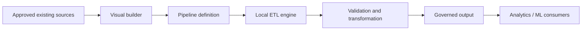

# Local Pipeline Studio

Local Pipeline Studio is a proposed local-first visual ETL platform for Concordia University’s SOEN 490 capstone. It aims to help process specialists build, validate, execute, inspect, version and reuse manufacturing data pipelines that integrate approved existing sources and models with analytics and machine-learning workflows.

## Project Status

**Planning and repository foundation. No application is implemented yet.** This repository provides engineering workflows, documentation templates and repository CI. Architecture, runtime, product dependencies and initial stories require team decisions. No releases or stakeholder approvals are claimed. See the [baseline audit](SOEN490_REPO_AUDIT.md).

## Problem

Preparing manufacturing data can involve repeated manual integration and inconsistent validation. The team must validate this problem, representative workflows and access to approved data with the stakeholder.

## Proposed Solution

A visual builder that produces reproducible pipeline definitions, executes locally, exposes intermediate previews and publishes governed outputs. Existing sources and data models remain authoritative.

## Core Capabilities

All product capabilities are **planned**: visual construction; reusable ETL blocks; file, SQL and REST ingestion; transformations; schema and quality validation; previews; local execution; logs and run history; pipeline versioning and reuse; governed Parquet/dataset outputs; potential local API; analytics and ML preparation; secure configuration. Scope and sequencing await stakeholder validation.

## Architecture



This is a proposed logical architecture. See [component status and boundaries](docs/architecture/system-architecture.md).

## Technology Stack

| Area | Current state |
|---|---|
| Product language, UI, engine, persistence | Not selected |
| Application package manager, build and test framework | Not selected |
| Repository tooling | Python 3.11+ standard library; Bash; Git |
| CI | GitHub Actions for repository checks; application CI pending |

## Getting Started

A new developer can clone and validate the repository today. Running the product will become possible after the first application implementation; no application install/start/build commands currently exist.

## Prerequisites

Git and Python 3.11+; Bash for GitHub setup scripts. GitHub CLI is optional for remote administration. No database, Node.js runtime, Python packages or credentials are required for repository checks.

## Installation

```sh
git clone https://github.com/ham340i/Industrial-Data-Pipelinen-Platform.git
cd Industrial-Data-Pipelinen-Platform
python3 --version
```

There are no application dependencies to install. Repository tooling uses only the standard library.

## Configuration

Repository checks require no configuration. No application environment variables exist yet, so no `.env.example` is supplied. Future configuration must document non-secret defaults and use local secret storage; see the [security plan](docs/security/security-plan.md).

## Running Locally

```sh
python3 scripts/check_repository.py
python3 scripts/check_docs.py
```

These validate the repository; they do not start an ETL application. The first implementation PR must add verified install, configuration, start, test and build commands here.

## Running Tests

```sh
python3 -m unittest discover -s scripts/tests -v
```

These exercise repository-checking tools. Product unit, integration and end-to-end tests do not exist yet. See the [testing plan](docs/testing/testing-plan.md) and [observed validation](docs/testing/repository-validation.md).

## Repository Structure

```text
.github/                Issue/PR forms, contribution policy and Actions
scripts/                Repository checks and GitHub administration helpers
docs/architecture/      Proposed boundaries and ADR template
docs/planning/          Schedule, Project setup, risks, scope and learning
docs/iterations/        Iteration evidence template
docs/releases/          Release evidence template
docs/meetings/           Minutes template
docs/stakeholder/        Review and signoff template
docs/testing/           Test strategy and repository validation
docs/security/          Credential and data handling
docs/performance/       Measurement plan
docs/deployment/        Environment and rollout plan
docs/legal/             Decisions requiring authorized approval
docs/demos/             Future video links
```

## Development Workflow

Requirement → feature label → issue → design → branch → commits → PR → tests → iteration → release → stakeholder feedback. Use [Contributing](.github/CONTRIBUTING.md) and the [Definition of Done](docs/planning/definition-of-done.md). Plan approximately two iterations ahead; each student needs visible engineering contributions every iteration.

## GitHub Project Board

Project URL: **TODO — create/link the actual board**. Follow [Project setup](docs/planning/github-project-setup.md), including sharing with **moar82**. No live Project configuration is claimed.

## Iterations & Releases

See the [exact course schedule](docs/iterations/README.md). Completion tags are `Iteration1` … `Iteration13`; release tags are `Release1`, `Release2`, `Release3`. Create them only after real completion. [Release process](docs/releases/README.md).

## Documentation

The [documentation index](docs/README.md) links all engineering and course evidence. [Requirements matrix](docs/SOEN490_REQUIREMENTS_MATRIX.md) distinguishes implemented scaffolding from outstanding evidence.

The [GitHub Wiki](https://github.com/ham340i/Industrial-Data-Pipelinen-Platform/wiki) provides a documentation entry point. Its navigation pages are prepared in [docs/wiki](docs/wiki/Home.md); first-page initialization and publication are pending. See [Wiki setup](scripts/github-setup/wiki-setup.md).

## Release Demos

[Demo registry](docs/demos/README.md) — all video links pending actual releases.

## Contributing

Read [Contributing](.github/CONTRIBUTING.md) before starting work. Use GitHub identities; keep student IDs, contact details, private manufacturing data and confidential agreements out of this repository.

## AI Usage

Disclose meaningful assistance in issues and PRs using [AI usage policy](.github/AI_USAGE.md). This repository foundation was drafted with Codex; human review is pending. Historical work is not attributed to AI.

## License

No license has been selected. Team/stakeholder approval is required; see [license and IP decision](docs/legal/README.md). No license grant is implied by this README.

## SOEN 490 Evaluation Navigation

| Evidence | Location |
|---|---|
| Engineering work | [Issues](https://github.com/ham340i/Industrial-Data-Pipelinen-Platform/issues), [PRs](https://github.com/ham340i/Industrial-Data-Pipelinen-Platform/pulls) |
| Current planning | [Project setup and pending URL](docs/planning/github-project-setup.md) |
| Architecture and decisions | [Architecture](docs/architecture/README.md) |
| Testing and CI | [Testing](docs/testing/testing-plan.md), [Actions](https://github.com/ham340i/Industrial-Data-Pipelinen-Platform/actions) |
| Iterations / individual contributions | [Iteration records](docs/iterations/README.md) |
| Releases / individual contributions | [Release records](docs/releases/README.md) |
| Meeting minutes | [Meetings](docs/meetings/README.md) |
| Risks | [Risk register](docs/planning/risks.md) |
| Demo videos | [Demos](docs/demos/README.md) |
| Stakeholder evidence | [Signoff records](docs/stakeholder/README.md) |
| Remaining gaps | [Human actions](SOEN490_HUMAN_ACTIONS.md), [requirements matrix](docs/SOEN490_REQUIREMENTS_MATRIX.md) |
