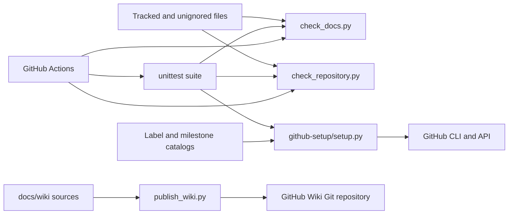
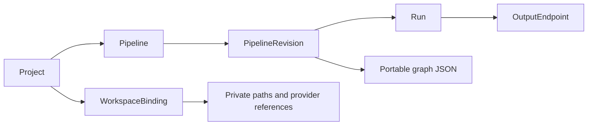

# Architecture

**Implemented:** repository tooling, React workbench shell, FastAPI shell, real-stack CI and local Compose workspace. Issue #7 adds SQLite metadata models/migrations in its feature PR, pending independent review.
**Planned:** complete visual authoring, connectors, graph validation/execution and governed output workflows.
**Experimental:** none recorded yet.

- [System architecture](system-architecture.md)
- [Data flow](data-flow.md)
- [Deployment architecture](deployment-architecture.md)
- [Architecture decision records](decisions/README.md)

The team-supplied [Release 1 target](release-1-target.md) specifies frameworks and persistence. Current metadata implementation: [models](../../app/metadata/models.py), [migration](../../migrations/versions/0001_initial_metadata_foundation.py), [ADR-0002](decisions/ADR-0002-sqlite-metadata.md) and [tests](../testing/issue-7-sqlite-metadata.md). Implementation does not imply complete release acceptance.

## Implemented repository tooling

`check_docs.py` resolves repository files and document links. `check_repository.py` validates syntax/configuration and reports suspicious secret paths. `setup.py` reconciles labels/milestones without overwriting existing records. The Wiki publisher prepares documentation navigation; live publication is still blocked on Wiki initialization. These modules are engineering infrastructure, not the ETL engine.

## Product layers and domain model

The original diagrams express proposed product boundaries. React and FastAPI shells are now implemented; issue #7 introduces the metadata domain below. Pipeline CRUD routes, SDK contracts and execution remain subsequent stories. A registry entry has independent composite block/version identity; block references inside graph JSON await #8/#9.

Arrows identify parent/child relationships or owned values. Each run retains its exact revision; exporting the definition returns only graph JSON. Private bindings are resolved separately at runtime. See the [metadata integration guide](../metadata.md).
