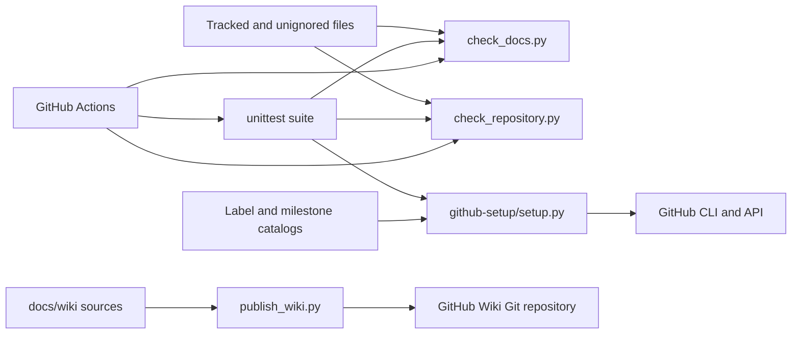

# Architecture

**Implemented:** repository documentation, templates and checking scripts only.
**Planned:** all application components.
**Experimental:** none recorded yet.

- [System architecture](system-architecture.md)
- [Data flow](data-flow.md)
- [Deployment architecture](deployment-architecture.md)
- [Architecture decision records](decisions/README.md)

Update status and add code/test links when components become real. No framework or persistence decision has been approved.

## Implemented repository tooling

`check_docs.py` resolves repository files and document links. `check_repository.py` validates syntax/configuration and reports suspicious secret paths. `setup.py` reconciles labels/milestones without overwriting existing records. The Wiki publisher prepares documentation navigation; live publication is still blocked on Wiki initialization. These modules are engineering infrastructure, not the ETL engine.

## Product layers and domain model

Frontend, backend, database, authentication, API routes, domain entities and product classes are **not implemented or chosen**. A product class/domain diagram would invent facts, so it is deferred to the first approved domain-design story. Existing diagrams express proposed boundaries only. Record later changes as linked ADRs and iteration deltas instead of redrawing history as if all components existed from day one.
