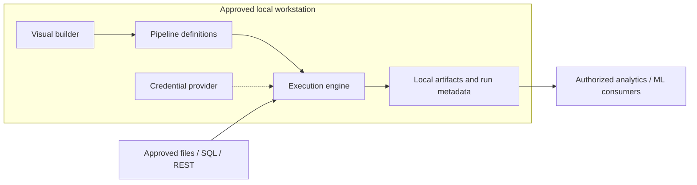

# Deployment architecture

Status: planned application topology. No installer or runtime is implemented.

The UI/engine process boundary, loopback binding, packaging and storage locations are undecided. If an API is introduced, evaluate authentication, origin checks and least-privilege access even on loopback. See [environment and rollout plan](../deployment/deployment-plan.md).
