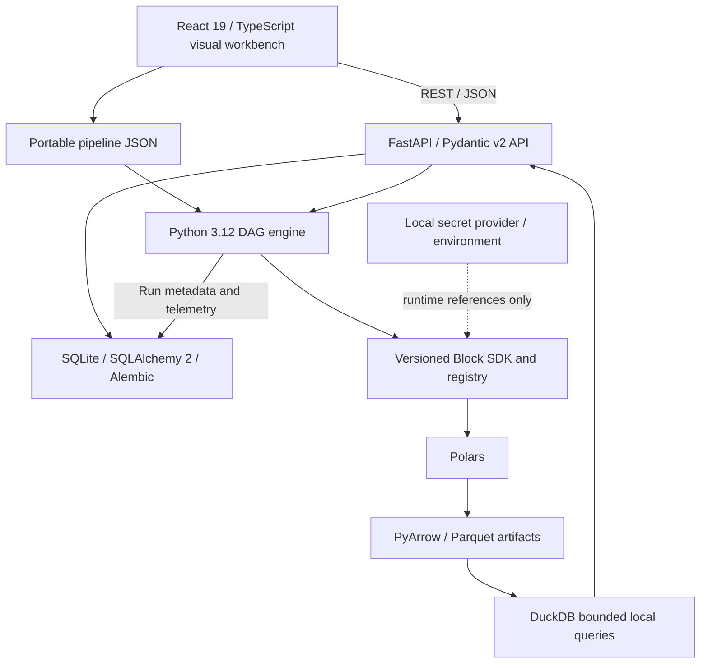

# Release 1 target architecture

Status: **team-supplied target for future implementation**, not implemented and not a retrospectively accepted ADR. Industry partner: Pratt & Whitney Canada; authorized data contracts and access still need confirmation. The existing product alias is Local Pipeline Studio.

## Boundaries

**UI authors definitions. Engine executes definitions.** The engine and Block SDK must work headlessly, without React or UI state dependencies.

## Target stack and responsibilities

| Layer | Target | Responsibility |
|---|---|---|
| UI | React 19, TypeScript, Vite, MUI | Local workbench, projects, editor panels and accessible feedback |
| Graph | @xyflow/react / React Flow | Nodes, typed ports, connections and layout |
| UI state | Zustand | Unsaved editor/selection state |
| Server state | TanStack Query, Axios | Typed API transport, caching, polling and errors |
| API | Python 3.12, FastAPI, Pydantic v2 | Validate requests, coordinate services, expose metadata/run/preview/output operations |
| Engine | Custom Python DAG engine | Deterministic local scheduling, context, lifecycle and failure propagation |
| Processing | Polars, Apache Arrow / PyArrow | Tabular transforms and explicit interchange/schema boundaries |
| Output/query | Apache Parquet, DuckDB | Local persisted datasets and bounded registered-artifact queries |
| Metadata | SQLite, SQLAlchemy 2, Alembic | Projects, pipeline metadata, runs, block registry, endpoint metadata and migrations |
| Definitions/versioning | JSON, Git | Portable definitions and engineering/definition history; automated UI Git operations not implied |
| Tests | pytest, Vitest, React Testing Library, Playwright | Feature-owned tests plus distributed integration/E2E responsibility |
| Quality/CI | Ruff, mypy, ESLint, Prettier, GitHub Actions | Real lint/type/format/test/build gates once sources exist |
| Packaging | Docker Compose initially | Reproducible local startup and persistent metadata/artifact volumes |

No dependency versions beyond the supplied major versions are invented. Foundation owners must verify compatibility, select package managers/lockfiles and record runnable commands. No dependencies are installed by this planning change.

## Definition and data boundaries

A definition includes schema version, graph/node/edge identities, block identifiers/versions, configuration and optional UI layout. It contains **no credentials**. Local secret references and source/output workspace paths are resolved by approved runtime configuration. Metadata must not become a second conflicting authoritative graph representation.

Triggers use control semantics, not fake tabular output. Manual and Timer initiate a run; tabular sources emit data. The initial Timer is a non-overlapping interval while the local service runs; no cron, durable scheduling or distributed guarantees.

SQL demonstrations use an approved available dialect, with a synthetic local database fallback. Read-only credentials/connection modes, bound parameters and constrained queries are required. DuckDB queries target registered artifact IDs with bounded results; arbitrary user SQL/file access is not the default API design.

## Planned services and schemas

Project/pipeline CRUD, validate, execute, preview, run status/details and output metadata/query are required API capabilities. Exact routes and schema/error versions belong to foundation design tasks; no endpoint is presented as already implemented.

Run metadata includes ID, pipeline/revision ID, state, start/end/duration, block states/timings, row counts, redacted logs and structured errors. Unknown counts are not zero. Output metadata is published only after a successful artifact write. Intermediate previews have explicit sample/resource bounds and no sink side effects.

## Decisions to record during implementation

Record ADRs for pipeline compatibility, local process/execution lifecycle, safe paths/secrets, type/null semantics and output consistency. Existing repository documentation recorded these choices as pending; this supplied target narrows the options but does not fabricate past decisions. See [release dependencies](../release-1-dependencies.md) and [Block SDK plan](block-sdk-release-1.md).
