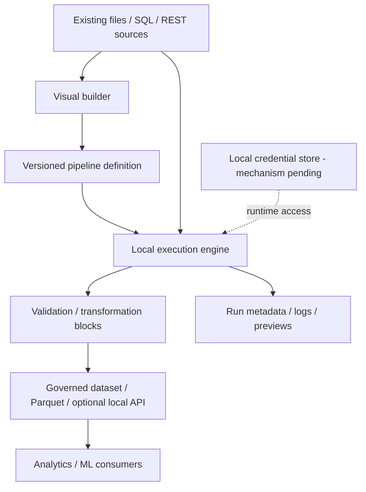

# System architecture

Status: **proposed; all application components planned**. Validate boundaries with the team and stakeholder before treating this as a design commitment.

| Boundary | Intended responsibility | Open decision |
|---|---|---|
| Visual builder | Author, configure and inspect pipelines | UI technology, keyboard interactions and graph model |
| Pipeline definition | Portable structure, parameters, block versions and source references | Serialization, schema migrations and reproducibility contract |
| Local engine | Schedule blocks, cancel runs and capture failure state | Runtime, process isolation, concurrency and resource limits |
| Connectors | Read approved sources under existing data contracts | Initial source scope, permission checks and retry behavior |
| ETL blocks | Transform and validate data with explicit contracts | Type system, null/date handling and extension API |
| Preview/history | Bounded previews and auditable run metadata | Storage, redaction, retention and recovery |
| Governed outputs | Publish validated artifacts with provenance | Format, atomic publication, access control and optional API |

## Local-first constraint

Data processing should run on an approved local workstation. Network access is limited to explicitly configured sources/outputs; a cloud service is not assumed. Hardware and stakeholder policy remain to be confirmed.

## Configuration and credentials

Separate portable pipeline configuration from machine-specific paths and secret references. Definitions, exports, logs, demos and version control must not contain credentials. Secret resolution belongs at the execution boundary; storage mechanism is undecided.

## Persistence and versioning

No database exists. Decide how to persist pipeline versions, run state, metadata and artifacts in an ADR. A run should eventually link a pipeline revision, block/dependency versions, input identity and validation results; reproducibility cannot be promised for mutable inputs without an input versioning policy.

## APIs and extension points

No endpoints or extension SDK exist. A local API is optional planned scope. Connector/block interfaces need explicit schemas, error handling, compatibility and trust boundaries before plugins are accepted. Existing manufacturing models remain authoritative; model mapping needs stakeholder approval.
