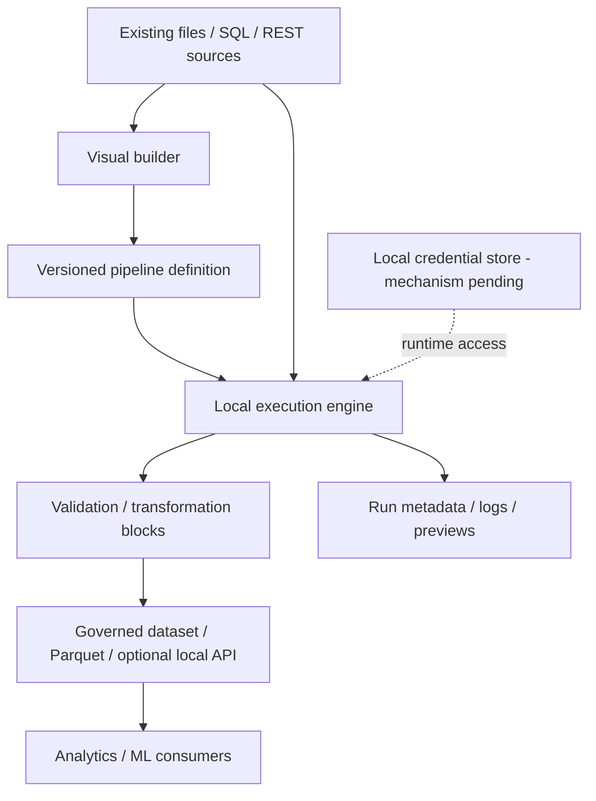

# System architecture

Status: **target workflow proposed; React/FastAPI shells implemented**. Issue #7 adds metadata persistence, pending independent review. Validate the remaining engine/connector boundaries with the team and stakeholder before treating them as commitments.

| Boundary | Intended responsibility | Open decision |
|---|---|---|
| Visual builder | Author, configure and inspect pipelines | UI technology, keyboard interactions and graph model |
| Pipeline definition | Portable structure, parameters, block versions and source references | Serialization, schema migrations and reproducibility contract |
| Local engine | Schedule blocks, cancel runs and capture failure state | Runtime, process isolation, concurrency and resource limits |
| Connectors | Read approved sources under existing data contracts | Initial source scope, permission checks and retry behavior |
| ETL blocks | Transform and validate data with explicit contracts | Type system, null/date handling and extension API |
| Preview/history | Bounded previews and auditable run metadata | Storage, redaction, retention and recovery |
| Governed outputs | Publish validated artifacts with provenance | Format, atomic publication, access control and optional API |

## Local-first constraint

Data processing should run on an approved local workstation. Network access is limited to explicitly configured sources/outputs; a cloud service is not assumed. Hardware and stakeholder policy remain to be confirmed.

## Configuration and credentials

Separate portable pipeline configuration from machine-specific paths and secret references. Definitions, exports, logs, demos and version control must not contain credentials. Secret resolution belongs at the execution boundary; storage mechanism is undecided.

## Persistence and versioning

Issue #7 introduces SQLite/SQLAlchemy metadata and Alembic migrations: [ADR-0002](decisions/ADR-0002-sqlite-metadata.md). Runs reference immutable pipeline revisions; graph JSON is the sole authoritative definition and private workspace bindings are separate. Input identity/versioning, validation results, telemetry and artifact publication remain later stories; reproducibility cannot be promised for mutable inputs without an input versioning policy.

## APIs and extension points

The FastAPI health/example endpoints exist. The supplied Release 1 target requires additional validation, execution, preview, run and output capabilities. Connector/block interfaces need explicit schemas, error handling, compatibility and trust boundaries before plugins are accepted. Existing manufacturing models remain authoritative; model mapping needs stakeholder approval.

## Release 1 scope update

The subsequent team brief specifies the [Release 1 target stack and boundaries](release-1-target.md) and [Block SDK](block-sdk-release-1.md). It resolves the earlier stack direction to React/TypeScript, FastAPI/Python 3.12, Polars/PyArrow, Parquet/DuckDB and SQLite/SQLAlchemy/Alembic. Shells and metadata now have implementation evidence; full processing and interface decisions remain open.
