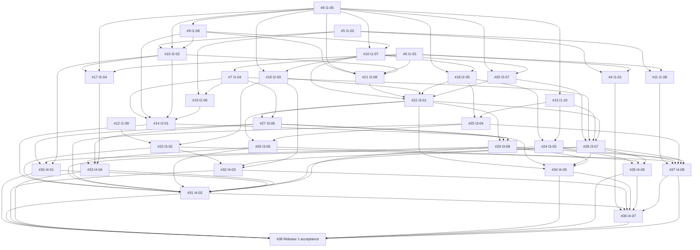

# Release 1 dependency graph

Arrows mean prerequisite → dependent. These are engineering completion/integration dependencies, not a ban on parallel contract design, mocks or tests. This is the planned dependency map; the [October 4 audit](team-readiness-2026-10-04.md) distinguishes merged foundations from pending work. The authoritative mapping is the [backlog](planning/release-1-backlog.json); each issue also lists what it blocks and what blocks it. Native GitHub relationships are verified in the setup report.

## Major paths

- SDK → portable definition/DAG → headless proof → hardened blocks/validation → production executor → preview/telemetry/triggers → UI integration → candidate packaging → acceptance.
- SQLite models → project UI/API → pipeline save/load → execute saved definitions → repeatable release workflow.
- Early SQL/data-contract and Polars/Arrow spikes → sources/type semantics → quality/join/output query → security/performance validation.
- Frontend/API shells → real test harnesses/CI → integration matrix → release candidate.

## Full graph

| Issue | Prerequisites for completion |
|---|---|
| [#4](https://github.com/ham340i/Industrial-Data-Pipelinen-Platform/issues/4) Reproducible local workspace and Compose startup | [#5](https://github.com/ham340i/Industrial-Data-Pipelinen-Platform/issues/5), [#6](https://github.com/ham340i/Industrial-Data-Pipelinen-Platform/issues/6) |
| [#5](https://github.com/ham340i/Industrial-Data-Pipelinen-Platform/issues/5) React 19 workbench shell and typed API client | None |
| [#6](https://github.com/ham340i/Industrial-Data-Pipelinen-Platform/issues/6) FastAPI shell with typed health and error contracts | None |
| [#7](https://github.com/ham340i/Industrial-Data-Pipelinen-Platform/issues/7) SQLite metadata models and migration foundation | [#6](https://github.com/ham340i/Industrial-Data-Pipelinen-Platform/issues/6) |
| [#8](https://github.com/ham340i/Industrial-Data-Pipelinen-Platform/issues/8) Versioned Block SDK and typed registry contract | None |
| [#9](https://github.com/ham340i/Industrial-Data-Pipelinen-Platform/issues/9) Portable pipeline JSON and DAG topology model | [#8](https://github.com/ham340i/Industrial-Data-Pipelinen-Platform/issues/8) |
| [#10](https://github.com/ham340i/Industrial-Data-Pipelinen-Platform/issues/10) Prove CSV to Select Columns to Parquet without the UI | [#8](https://github.com/ham340i/Industrial-Data-Pipelinen-Platform/issues/8), [#9](https://github.com/ham340i/Industrial-Data-Pipelinen-Platform/issues/9) |
| [#11](https://github.com/ham340i/Industrial-Data-Pipelinen-Platform/issues/11) Application test harnesses and real stack CI gates | [#5](https://github.com/ham340i/Industrial-Data-Pipelinen-Platform/issues/5), [#6](https://github.com/ham340i/Industrial-Data-Pipelinen-Platform/issues/6) |
| [#12](https://github.com/ham340i/Industrial-Data-Pipelinen-Platform/issues/12) Spike approved data contracts and safe SQL connectivity | None |
| [#13](https://github.com/ham340i/Industrial-Data-Pipelinen-Platform/issues/13) Spike Polars Arrow schema and memory behavior | [#8](https://github.com/ham340i/Industrial-Data-Pipelinen-Platform/issues/8) |
| [#14](https://github.com/ham340i/Industrial-Data-Pipelinen-Platform/issues/14) Save and reload portable pipelines in the workbench | [#7](https://github.com/ham340i/Industrial-Data-Pipelinen-Platform/issues/7), [#9](https://github.com/ham340i/Industrial-Data-Pipelinen-Platform/issues/9), [#15](https://github.com/ham340i/Industrial-Data-Pipelinen-Platform/issues/15), [#19](https://github.com/ham340i/Industrial-Data-Pipelinen-Platform/issues/19) |
| [#15](https://github.com/ham340i/Industrial-Data-Pipelinen-Platform/issues/15) React Flow canvas and discoverable block library | [#5](https://github.com/ham340i/Industrial-Data-Pipelinen-Platform/issues/5), [#8](https://github.com/ham340i/Industrial-Data-Pipelinen-Platform/issues/8), [#9](https://github.com/ham340i/Industrial-Data-Pipelinen-Platform/issues/9) |
| [#16](https://github.com/ham340i/Industrial-Data-Pipelinen-Platform/issues/16) CSV JSON and Parquet source blocks | [#8](https://github.com/ham340i/Industrial-Data-Pipelinen-Platform/issues/8), [#10](https://github.com/ham340i/Industrial-Data-Pipelinen-Platform/issues/10) |
| [#17](https://github.com/ham340i/Industrial-Data-Pipelinen-Platform/issues/17) Schema-driven block configuration panel | [#15](https://github.com/ham340i/Industrial-Data-Pipelinen-Platform/issues/15), [#8](https://github.com/ham340i/Industrial-Data-Pipelinen-Platform/issues/8), [#6](https://github.com/ham340i/Industrial-Data-Pipelinen-Platform/issues/6) |
| [#18](https://github.com/ham340i/Industrial-Data-Pipelinen-Platform/issues/18) Select Rename Filter and Cast transform blocks | [#8](https://github.com/ham340i/Industrial-Data-Pipelinen-Platform/issues/8), [#10](https://github.com/ham340i/Industrial-Data-Pipelinen-Platform/issues/10) |
| [#19](https://github.com/ham340i/Industrial-Data-Pipelinen-Platform/issues/19) Create list and open local projects | [#5](https://github.com/ham340i/Industrial-Data-Pipelinen-Platform/issues/5), [#7](https://github.com/ham340i/Industrial-Data-Pipelinen-Platform/issues/7) |
| [#20](https://github.com/ham340i/Industrial-Data-Pipelinen-Platform/issues/20) Parquet and CSV sink blocks | [#8](https://github.com/ham340i/Industrial-Data-Pipelinen-Platform/issues/8), [#10](https://github.com/ham340i/Industrial-Data-Pipelinen-Platform/issues/10) |
| [#21](https://github.com/ham340i/Industrial-Data-Pipelinen-Platform/issues/21) Validate graph ports and required configuration before run | [#9](https://github.com/ham340i/Industrial-Data-Pipelinen-Platform/issues/9), [#8](https://github.com/ham340i/Industrial-Data-Pipelinen-Platform/issues/8), [#6](https://github.com/ham340i/Industrial-Data-Pipelinen-Platform/issues/6), [#15](https://github.com/ham340i/Industrial-Data-Pipelinen-Platform/issues/15) |
| [#22](https://github.com/ham340i/Industrial-Data-Pipelinen-Platform/issues/22) Production local DAG executor and Polars context | [#10](https://github.com/ham340i/Industrial-Data-Pipelinen-Platform/issues/10), [#21](https://github.com/ham340i/Industrial-Data-Pipelinen-Platform/issues/21), [#16](https://github.com/ham340i/Industrial-Data-Pipelinen-Platform/issues/16), [#18](https://github.com/ham340i/Industrial-Data-Pipelinen-Platform/issues/18), [#20](https://github.com/ham340i/Industrial-Data-Pipelinen-Platform/issues/20) |
| [#23](https://github.com/ham340i/Industrial-Data-Pipelinen-Platform/issues/23) Read-only SQL source with secret references | [#12](https://github.com/ham340i/Industrial-Data-Pipelinen-Platform/issues/12), [#16](https://github.com/ham340i/Industrial-Data-Pipelinen-Platform/issues/16) |
| [#24](https://github.com/ham340i/Industrial-Data-Pipelinen-Platform/issues/24) Join Aggregate and Sort transform blocks | [#18](https://github.com/ham340i/Industrial-Data-Pipelinen-Platform/issues/18), [#13](https://github.com/ham340i/Industrial-Data-Pipelinen-Platform/issues/13) |
| [#25](https://github.com/ham340i/Industrial-Data-Pipelinen-Platform/issues/25) Null handling and data-quality validation blocks | [#18](https://github.com/ham340i/Industrial-Data-Pipelinen-Platform/issues/18), [#13](https://github.com/ham340i/Industrial-Data-Pipelinen-Platform/issues/13) |
| [#26](https://github.com/ham340i/Industrial-Data-Pipelinen-Platform/issues/26) Bounded selected-node preview with schema and samples | [#22](https://github.com/ham340i/Industrial-Data-Pipelinen-Platform/issues/22), [#25](https://github.com/ham340i/Industrial-Data-Pipelinen-Platform/issues/25) |
| [#27](https://github.com/ham340i/Industrial-Data-Pipelinen-Platform/issues/27) Persist run telemetry and expose status/details APIs | [#22](https://github.com/ham340i/Industrial-Data-Pipelinen-Platform/issues/22), [#7](https://github.com/ham340i/Industrial-Data-Pipelinen-Platform/issues/7) |
| [#28](https://github.com/ham340i/Industrial-Data-Pipelinen-Platform/issues/28) Govern Parquet artifacts and query them with DuckDB | [#20](https://github.com/ham340i/Industrial-Data-Pipelinen-Platform/issues/20), [#7](https://github.com/ham340i/Industrial-Data-Pipelinen-Platform/issues/7), [#13](https://github.com/ham340i/Industrial-Data-Pipelinen-Platform/issues/13), [#22](https://github.com/ham340i/Industrial-Data-Pipelinen-Platform/issues/22) |
| [#29](https://github.com/ham340i/Industrial-Data-Pipelinen-Platform/issues/29) Manual and bounded timer triggers with execute API | [#22](https://github.com/ham340i/Industrial-Data-Pipelinen-Platform/issues/22), [#27](https://github.com/ham340i/Industrial-Data-Pipelinen-Platform/issues/27), [#14](https://github.com/ham340i/Industrial-Data-Pipelinen-Platform/issues/14) |
| [#30](https://github.com/ham340i/Industrial-Data-Pipelinen-Platform/issues/30) Run monitoring UI with block state and logs | [#27](https://github.com/ham340i/Industrial-Data-Pipelinen-Platform/issues/27), [#29](https://github.com/ham340i/Industrial-Data-Pipelinen-Platform/issues/29), [#15](https://github.com/ham340i/Industrial-Data-Pipelinen-Platform/issues/15) |
| [#31](https://github.com/ham340i/Industrial-Data-Pipelinen-Platform/issues/31) Integrate author preview execute workflow with Playwright | [#14](https://github.com/ham340i/Industrial-Data-Pipelinen-Platform/issues/14), [#23](https://github.com/ham340i/Industrial-Data-Pipelinen-Platform/issues/23), [#24](https://github.com/ham340i/Industrial-Data-Pipelinen-Platform/issues/24), [#25](https://github.com/ham340i/Industrial-Data-Pipelinen-Platform/issues/25), [#26](https://github.com/ham340i/Industrial-Data-Pipelinen-Platform/issues/26), [#28](https://github.com/ham340i/Industrial-Data-Pipelinen-Platform/issues/28), [#29](https://github.com/ham340i/Industrial-Data-Pipelinen-Platform/issues/29), [#30](https://github.com/ham340i/Industrial-Data-Pipelinen-Platform/issues/30), [#33](https://github.com/ham340i/Industrial-Data-Pipelinen-Platform/issues/33) |
| [#32](https://github.com/ham340i/Industrial-Data-Pipelinen-Platform/issues/32) Harden file SQL and configuration security boundaries | [#23](https://github.com/ham340i/Industrial-Data-Pipelinen-Platform/issues/23), [#28](https://github.com/ham340i/Industrial-Data-Pipelinen-Platform/issues/28), [#16](https://github.com/ham340i/Industrial-Data-Pipelinen-Platform/issues/16) |
| [#33](https://github.com/ham340i/Industrial-Data-Pipelinen-Platform/issues/33) Actionable validation preview and execution error UX | [#26](https://github.com/ham340i/Industrial-Data-Pipelinen-Platform/issues/26), [#27](https://github.com/ham340i/Industrial-Data-Pipelinen-Platform/issues/27), [#17](https://github.com/ham340i/Industrial-Data-Pipelinen-Platform/issues/17) |
| [#34](https://github.com/ham340i/Industrial-Data-Pipelinen-Platform/issues/34) Stabilize execution failures and output cleanup | [#22](https://github.com/ham340i/Industrial-Data-Pipelinen-Platform/issues/22), [#27](https://github.com/ham340i/Industrial-Data-Pipelinen-Platform/issues/27), [#28](https://github.com/ham340i/Industrial-Data-Pipelinen-Platform/issues/28), [#29](https://github.com/ham340i/Industrial-Data-Pipelinen-Platform/issues/29) |
| [#35](https://github.com/ham340i/Industrial-Data-Pipelinen-Platform/issues/35) Measure representative workloads and tune bounded execution | [#24](https://github.com/ham340i/Industrial-Data-Pipelinen-Platform/issues/24), [#26](https://github.com/ham340i/Industrial-Data-Pipelinen-Platform/issues/26), [#28](https://github.com/ham340i/Industrial-Data-Pipelinen-Platform/issues/28) |
| [#36](https://github.com/ham340i/Industrial-Data-Pipelinen-Platform/issues/36) Package and verify the local Release 1 candidate | [#4](https://github.com/ham340i/Industrial-Data-Pipelinen-Platform/issues/4), [#31](https://github.com/ham340i/Industrial-Data-Pipelinen-Platform/issues/31), [#32](https://github.com/ham340i/Industrial-Data-Pipelinen-Platform/issues/32), [#34](https://github.com/ham340i/Industrial-Data-Pipelinen-Platform/issues/34), [#35](https://github.com/ham340i/Industrial-Data-Pipelinen-Platform/issues/35), [#37](https://github.com/ham340i/Industrial-Data-Pipelinen-Platform/issues/37) |
| [#37](https://github.com/ham340i/Industrial-Data-Pipelinen-Platform/issues/37) API engine block integration matrix and compatibility fixes | [#11](https://github.com/ham340i/Industrial-Data-Pipelinen-Platform/issues/11), [#23](https://github.com/ham340i/Industrial-Data-Pipelinen-Platform/issues/23), [#24](https://github.com/ham340i/Industrial-Data-Pipelinen-Platform/issues/24), [#25](https://github.com/ham340i/Industrial-Data-Pipelinen-Platform/issues/25), [#28](https://github.com/ham340i/Industrial-Data-Pipelinen-Platform/issues/28), [#29](https://github.com/ham340i/Industrial-Data-Pipelinen-Platform/issues/29) |

## Estimate-weighted engineering chain

[#8](https://github.com/ham340i/Industrial-Data-Pipelinen-Platform/issues/8) → [#9](https://github.com/ham340i/Industrial-Data-Pipelinen-Platform/issues/9) → [#15](https://github.com/ham340i/Industrial-Data-Pipelinen-Platform/issues/15) → [#21](https://github.com/ham340i/Industrial-Data-Pipelinen-Platform/issues/21) → [#22](https://github.com/ham340i/Industrial-Data-Pipelinen-Platform/issues/22) → [#27](https://github.com/ham340i/Industrial-Data-Pipelinen-Platform/issues/27) → [#29](https://github.com/ham340i/Industrial-Data-Pipelinen-Platform/issues/29) → [#30](https://github.com/ham340i/Industrial-Data-Pipelinen-Platform/issues/30) → [#31](https://github.com/ham340i/Industrial-Data-Pipelinen-Platform/issues/31) → [#36](https://github.com/ham340i/Industrial-Data-Pipelinen-Platform/issues/36) → [#38](https://github.com/ham340i/Industrial-Data-Pipelinen-Platform/issues/38)

This longest path totals **162 primary ideal hours** under the initial decomposition. It is not a duration forecast: actual calendar scheduling depends on availability, contract-first overlap, reviews and re-estimation. Do not add reviewer hours to individual edges and pretend they predict dates. The short Iteration 1 foundation window and the I4 integration-to-packaging chain deserve early progress checks.

No cycles or dependencies on a later iteration are allowed. Plan validation checks both. Resolve contract changes explicitly and update native links, issue bodies and this map together.
